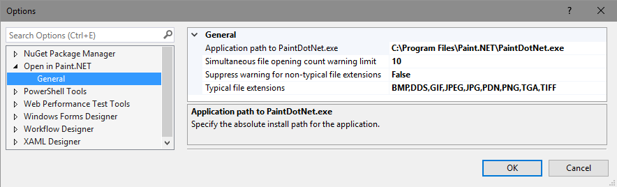

# Open In Gregt

Download this extension from the [VS Marketplace](https://marketplace.visualstudio.com/items?itemName=GregTrevellick.$gregt$).

---------------------------------------

<!--COPY START FOR VS GALLERY-->

A Visual Studio extension to open a file in [Paint.NET](http://www.getpaint.net/) directly from within Visual Studio.

If you like this *free* extension, please give it a [review](https://marketplace.visualstudio.com/items?itemName=GregTrevellick.$gregt$#review-details).

See the [change log](CHANGELOG.md) for road map and release history. Bugs can be logged [here](https://github.com/GregTrevellick/OpenInPaintDotNet/issues).

## Features

- Open multiple files simultaneously with Paint.NET directly from within Solution Explorer.

- Warning if attemptimg to open a large quantity of files. The quantity is configurable, and if set very high effectively suppresses the warning altogether.

- Warning if attempting to open one or more file types whose extension is not typically associated with Paint.NET. The list of typical file extensions is configurable in Tools | Options, and the warning message can be suppressed.

## Options

<!--COPY END FOR VS GALLERY-->

## Contribute

Contributions to this project are welcome by raising an [Issue](https://github.com/GregTrevellick/OpenInPaintDotNet/issues) or submitting a [Pull Request](https://github.com/GregTrevellick/OpenInPaintDotNet/pulls).

## License

[MIT](/LICENSE.txt)

## Credits

Adapted from code originally written by [Mads Kristensen](https://github.com/madskristensen) [here](https://github.com/madskristensen/OpenInSublimeText/ "Open in Sublime Text") and [here](https://github.com/madskristensen/OpenInVsCode "Open in Visual Studio Code").

Also adapted from code originally written by [Calvin Allen](https://github.com/CalvinAllen) [here](https://github.com/CalvinAllen/OpenInNotepadPlusPlus).

Additional thanks goes to [Build 2016 Conference](https://channel9.msdn.com/Events/Build/2016/B886) and [Visual Studio Toolbox](https://channel9.msdn.com/Shows/Visual-Studio-Toolbox/Extensions-by-Mads-Kristensen).

Thanks also to [Paint.NET](http://www.getpaint.net/) themselves.
